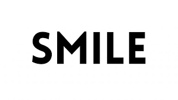

Examples
========

Here are some examples of the program input and output.
Original images are on the left and vectorized on the right side.

**Binary image:**

|pic1|  |pic2|

**Grayscale image:**

|pic3|  |pic4|

|pic5|  |pic6|

|pic7|  |pic8|

**Image with text:**

Text is usually a difficult case for vectorization algorithms. Here is the example of how potrace deals with it:

|pic9|  |pic10|

|pic11|  |pic12|

